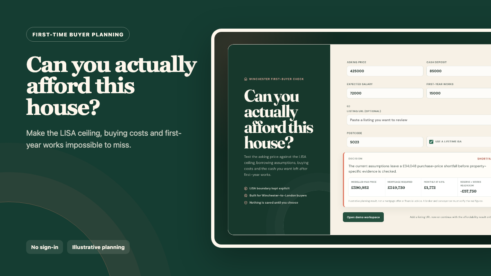

# Winchester Buyer Check

A polished, browser-only homebuyer budget calculator. It estimates mortgage payments, loan-to-value, cash needed at completion, an ownership buffer and total term interest.

**Live app:** https://matthewpaver.github.io/winchester-buyer-check/



## Why this public edition exists

This is a deliberately limited public calculator extracted from a larger private property-decision product. It provides a useful, no-sign-up demo without publishing the private evidence engine, data operations or commercial workflow.

## Use it locally

Open `index.html`, or run any static server:

```bash
python3 -m http.server 8000
```

Then visit http://localhost:8000.

All calculations happen locally. No figures are transmitted or stored. The calculator is illustrative and is not financial, tax, legal or mortgage advice.

## Rights

Copyright © 2026 Matthew Paver. This repository is publicly viewable, but no open-source licence is granted. See [NOTICE.md](NOTICE.md).
