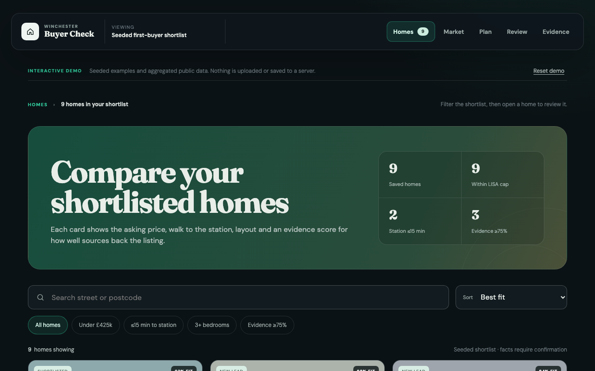
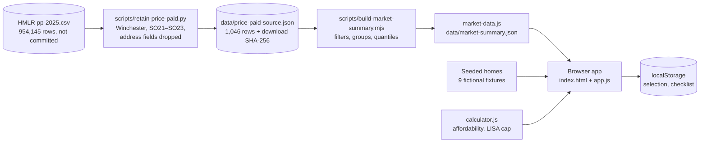

# Winchester Buyer Check: evidence before an offer

A browser-only decision aid for first-time buyers in Winchester: it puts price, commute, affordability and source evidence side by side, so a viewing is judged on traceable data before it turns into an emotional offer.

[](https://github.com/MatthewPaver/winchester-buyer-check/actions/workflows/pages.yml)
[](LICENSE)



**Live demo:** <https://matthewpaver.github.io/winchester-buyer-check/>. No sign-up or install. Try **Under £425k**, open a home, check its evidence list, then change the affordability inputs.

The nine shortlisted homes are fictional fixtures. The market view is built from a real, traceable 2025 HM Land Registry snapshot. The decision checks are fixed rules; there is no AI or LLM in this project.

## The problem

A first-time buyer in Winchester with a Lifetime ISA has a hard ceiling: the LISA can only be used on a home costing £450,000 or less. Asking prices sit close to that line, listing photos do the persuading, and the evidence that should decide an offer (what similar homes actually sold for, how long the walk to the station really is, which facts are only the agent's claim) is scattered or missing.

The demo keeps that evidence in one place:

1. **Can I afford it, and does the LISA still apply?** A calculator for deposit, loan, monthly payment and the £450,000 cap.
2. **What did comparable homes sell for?** Observed 25th–75th percentile sale prices by outward postcode and property type, from HMLR Price Paid Data.
3. **What still needs checking?** An evidence checklist and source register per home, with rule-based checks on finance, commute and evidence gaps, and an offer range.

## Quickstart

No dependencies to run it. Tests use Node 22 and Python 3.13 (the CI versions).

```bash
git clone https://github.com/MatthewPaver/winchester-buyer-check.git && cd winchester-buyer-check
python3 -m http.server 8765                       # then open http://127.0.0.1:8765/
node --test tests/*.test.cjs                      # expect: # pass 9, # fail 0
python3 -m unittest discover -s tests -p 'test_*.py'   # expect: OK
```

The optional browser journey (desktop and mobile navigation, market filters, source counts, affordability inputs) needs the server running and Playwright:

```bash
python3 -m venv .venv && .venv/bin/python -m pip install playwright==1.58.0
.venv/bin/python -m playwright install chromium && .venv/bin/python tests/smoke.py
```

Screenshots go to `/tmp` unless `WINCHESTER_SHOWCASE_PATH` is set; `WINCHESTER_BASE_URL` overrides the default port.

## How it works


```mermaid
flowchart LR
    H[("HMLR pp-2025.csv<br/>954,145 rows, not committed")] --> R["scripts/retain-price-paid.py<br/>Winchester, SO21–SO23,<br/>address fields dropped"]
    R --> S[("data/price-paid-source.json<br/>1,046 rows + download SHA-256")]
    S --> B["scripts/build-market-summary.mjs<br/>filters, groups, quantiles"]
    B --> M["market-data.js<br/>data/market-summary.json"]
    M --> A["Browser app<br/>index.html + app.js"]
    F["Seeded homes<br/>9 fictional fixtures"] --> A
    C["calculator.js<br/>affordability, LISA cap"] --> A
    A --> L[("localStorage<br/>selection, checklist")]
```

| Path | Role |
| --- | --- |
| `scripts/retain-price-paid.py` | Projects a downloaded HMLR yearly CSV to Winchester district, SO21–SO23 and seven columns; records the whole-file SHA-256 |
| `data/price-paid-source.json` | The committed, address-minimised snapshot the app is built from |
| `scripts/build-market-summary.mjs` | Applies the inclusion filters and writes groups, counts and percentile bands to `market-data.js` and `data/market-summary.json` |
| `calculator.js` | Pure affordability and purchase-cost functions, shared by the browser and the Node tests |
| `app.js` | The single-page UI: shortlist, market view, plan, review, evidence checklist. State stays in the browser |
| `docs/MARKET_DATA_CONTRACT.md` | Exact filters, counts, quantile method and what the snapshot must not be used to claim |

## Results: what the data supports

The market view reconciles from the official download to the numbers on screen. Every count below is recorded in `data/market-summary.json` and re-derived by the tests.

| Stage | Rows |
| --- | --- |
| HMLR 2025 yearly file, retrieved 5 September 2026 | 954,145 |
| Retained: district `WINCHESTER`, outward postcode SO21, SO22 or SO23 | 1,046 |
| Included: category A, record status A, four residential types, £50,000–£3,000,000 | 931 |
| Grouped: outward postcode × property type | 12 groups, 931 sales |

Reproduce from the committed snapshot, with no network access:

```bash
node scripts/build-market-summary.mjs && git diff --exit-code -- data/market-summary.json market-data.js
```

CI runs exactly this and fails if the regenerated files differ by a byte. The Node tests also check the source SHA-256, recount every group independently, and confirm that no full postcode or street address is retained.

To refresh from HMLR (about 159 MiB; never needed to run the demo):

```bash
curl --fail --location https://price-paid-data.publicdata.landregistry.gov.uk/pp-2025.csv -o /tmp/pp-2025.csv
python3 scripts/retain-price-paid.py /tmp/pp-2025.csv && node scripts/build-market-summary.mjs
```

HMLR revises the yearly file monthly, so a new download is a new snapshot and should be reviewed as one.

What this does not show:

- **A valuation.** The bands are the observed 25th–75th percentiles of completed 2025 sales in a postcode and type group. They are not confidence intervals and say nothing about a specific home.
- **Anything about the nine homes.** They are fictional and not linked to any HMLR transaction. Their fit scores (68–92) and verdicts are fixture values written into `app.js`, not computed from the market data.

## Design decisions and trade-offs

- **Static and browser-only over a backend.** An earlier private prototype (now archived) had accounts, persistent workspaces and background jobs. This edition has none: nothing to host or secure, and inputs never leave the browser (`localStorage`). Cost: no saved workspace across devices and no live listings.
- **A committed, address-minimised projection over fetching HMLR at runtime or committing the full CSV.** The app and its tests work offline, the 159 MiB file stays out of Git, and only transaction ID, price, date, outward postcode, type, category and record status are kept. Cost: the snapshot ages, and refreshing it is a manual, reviewed step.
- **Generated market figures, checked in CI, over hand-entered numbers.** An earlier version showed a market claim with no traceable source; it was replaced by this pipeline. Every figure on the market screen is produced by one script from one checksummed file. Cost: an extra build step that must be re-run after any change to the source or filters.
- **Fixed-threshold rules over a model or LLM score.** The review checks are explicit: the £450,000 LISA cap, a station walk of 15 or 22 minutes, evidence coverage of 75%. Anyone can read why a home is flagged, and the same inputs always give the same answer. Cost: the thresholds are judgement calls, not calibrated against outcomes.
- **Fictional homes over real listings.** Scraping property portals raises rights questions, and showing a real address invites people to treat the demo's view of it as fact. Cost: the shortlist demonstrates the workflow, not a live search.

## Limits and non-goals

- Not financial, mortgage, tax or legal advice. The calculator is illustrative; see [NOTICE.md](NOTICE.md).
- No live listings, no listing search, no account, no mortgage decision and no offer submission.
- Market context covers 2025 completed sales only, for one district and three outward postcodes.
- Commute is a station walk time per fixture home, not a routed journey.
- Fit scores, verdicts and offer ranges for the shortlist are illustrative fixture logic.
- One 711-line `app.js` renders every screen. That suits a static demo; a larger product would split it.

## Repository layout and tests

```text
index.html, app.js, styles.css   the single-page app
calculator.js                    affordability and purchase-cost functions (browser + Node)
market-data.js                   generated market view loaded by the page
data/                            retained HMLR source and generated summary JSON
scripts/                         retain-price-paid.py (projection), build-market-summary.mjs (aggregates)
tests/                           Node tests (calculator, market data), Python projection tests, Playwright journey
docs/                            market data contract, README screenshot
```

CI ([`pages.yml`](.github/workflows/pages.yml)) runs on every push and pull request: the Node and Python tests, the byte-identical regeneration check and the Playwright journey. It deploys to GitHub Pages only from `main` and only after those pass.

## Licence

Code: MIT. See [LICENSE](LICENSE). The project name and artwork are excluded; see [NOTICE.md](NOTICE.md).

Market data: contains HM Land Registry data © Crown copyright and database right 2021. This data is licensed under the Open Government Licence v3.0.
